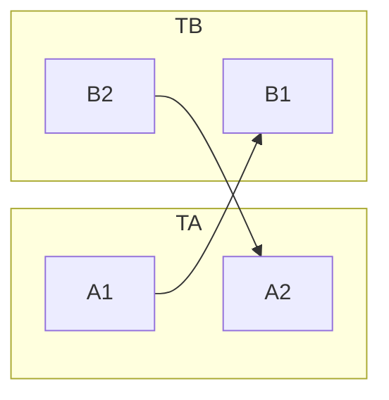

    
Table of Contents

- [My VIM Notes](#my-vim-notes)

 

# My VIM Notes
- [ ] Searching
- [ ] Copying
- [ ] Plugins
  - [ ] [Leaderf]()
  - [ ] [Clang-Format]()
  - [ ] [Airline]()
  - [ ] [Tabular]()
  - [ ] [NerdCommenter]()
  - [ ] [Surround](doc/vim-surround.md)

